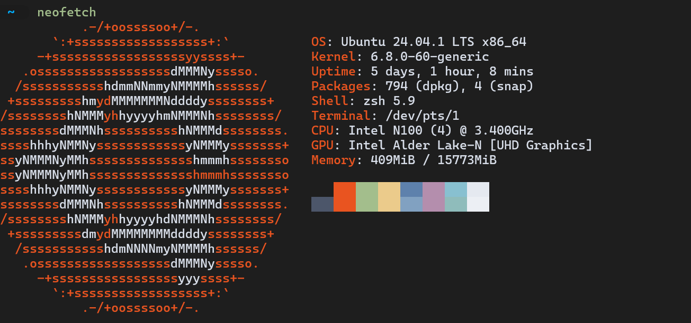

# Oh my zsh



If you are looking for a powerful and customizable terminal experience, Oh My Zsh is a great choice. It is a framework for managing your Zsh configuration, providing a wide range of plugins and themes to enhance your terminal experience.

## Installation

1. First, ensure you have Zsh, Git, and Curl installed on your system. You can install them using the following command:
```bash
sudo apt update && sudo apt install -y zsh git curl
```
2. Next, you can install Oh My Zsh using the following command:

```bash
export RUNZSH=no
sh -c "$(curl -fsSL https://raw.githubusercontent.com/ohmyzsh/ohmyzsh/master/tools/install.sh)"
```

3. Install theme Powerlevel10k

```bash
git clone --depth=1 https://github.com/romkatv/powerlevel10k.git ~/.config/powerlevel10k
```

edit your `~/.zshrc` file to set the theme:

```bash
nano ~/.zshrc

ZSH_THEME="powerlevel10k/powerlevel10k"
```

